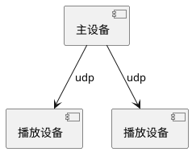
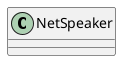

# NetSpeaker



主设备收集音频信息，通过udp发送到播放设备，播放设备播放声音。



## 组播

### 1. 初始化

```cpp
    udpSocket = new QUdpSocket(this); // 用于与连接的客户端通讯的QUpSocket
    // Multicast路由层次，1表示只在同一局域网内
    // 组播TTL: 生存时间，每跨1个路由会减1，多播无法跨过大多数路由所以为1
    // 默认值是1，表示数据包只能在本地的子网中传送。
    udpSocket->setSocketOption(QAbstractSocket::MulticastTtlOption, 1);
    connect(udpSocket, SIGNAL(readyRead()), this, SLOT(onSocketReadyRead()));
```

### 2. 加入组播

```cpp
void MainWindow::on_actJoin_triggered()
{
    QString IP = ui->comboIP->currentText();
    groupAddress = QHostAddress(IP); // 多播组地址
    quint16 groupPort=ui->spinPort->value(); // 端口

    // QHostAddress::AnyIPv4 与此地址绑定的socket将仅侦听IPv4交互
    // groupPort，多播组统一的一个端口
    // QUdpSocket::ShareAddress 允许其他服务绑定到相同的地址和端口
    // QUdpSocket::ReuseAddressHint 向QAbstractSocket提供提示，提示它应尝试重新绑定服务，即使地址和端口已被另一个套接字绑定。在Windows和Unix上，这相当于SO_REUSEADDR套接字选项。
    // QUdpSocket::ShareAddress | QUdpSocket::ReuseAddressHint 组合使用才能在本机同时启动多个程序绑定相同端口，适合没有局域网只有一台电脑的本地测试使用
    if (udpSocket->bind(QHostAddress::AnyIPv4, groupPort, QUdpSocket::ShareAddress | QUdpSocket::ReuseAddressHint)) //先绑定端口
    {
        udpSocket->joinMulticastGroup(groupAddress); //加入IP地址为groupAddress的多播组，绑定端口groupPort进行通信
        ui->plainTextEdit->appendPlainText("**加入组播成功");
        ui->plainTextEdit->appendPlainText("**组播地址IP："+IP);
        ui->plainTextEdit->appendPlainText("**绑定端口："+QString::number(groupPort));
        ui->actJoin>setEnabled(false);
        ui->actLeave->setEnabled(true);
        ui->comboIP->setEnabled(false);
    }
    else
        ui->plainTextEdit->appendPlainText("**绑定端口失败");
}
```

### 3. 发送组播消息

```cpp
void MainWindow::on_btnMulticast_clicked()
{
    quint16 groupPor t= ui->spinPort->value();
    QString msg = ui->editMsg->text();
    QByteArray datagram = msg.toUtf8();

    udpSocket->writeDatagram(datagram,groupAddress,groupPort);
    ui->plainTextEdit->appendPlainText("[multicst] "+msg);
    ui->editMsg->clear();
    ui->editMsg->setFocus();
}
```

### 4. 读取数据报

```cpp
// 由readyRead（）信号触发的槽函数。
// 绑定端口后，只要有UDP数据报到达指定的地址和端口，就会发出信号QUdpSocket::readyRead()
void MainWindow::onSocketReadyRead()
{
    while(udpSocket->hasPendingDatagrams())
    {
        QByteArray datagram;
        datagram.resize(udpSocket->pendingDatagramSize());
        QHostAddress peerAddr;
        quint16 peerPort;
        udpSocket->readDatagram(datagram.data(),datagram.size(),&peerAddr,&peerPort);
        QString str = datagram.data();
        QString peer = "[From "+peerAddr.toString()+":"+QString::number(peerPort)+"] ";
        ui->plainTextEdit->appendPlainText(peer+str);
    }
}
```

### 5. 退出组播

```cpp
void MainWindow::on_actLeave_triggered()
{
    udpSocket->leaveMulticastGroup(groupAddress);// 退出组播
    udpSocket->abort(); // 中止当前连接并重置套接字。与disconnectFromHost()不同，此函数会立即关闭套接字，丢弃写入缓冲区中的所有挂起数据。
    ui->actJoin->setEnabled(true);
    ui->actLeave->setEnabled(false);
    ui->comboIP->setEnabled(true);
    ui->plainTextEdit->appendPlainText("**已退出组播,解除端口绑定");
}
```

## Qt音频采集

该部分均摘录自[Qt由入门到放弃-音频采集与录制_qaudioencodersettings-CSDN博客](https://blog.csdn.net/bwangk/article/details/108734414)

### Qt pro 配置

qt6以上不能使用，QAudioFormat接口改了，另外增加了QAudioSink

```pro
QT += multimedia #在Pro中添加使用qt多媒体模块
```

### QAudioFormat音频格式类

```cpp
QAudioFormat format;
format.setSampleRate(16000);
//设定声道数目，mono(平声道)的声道数目是1；stero(立体声)的声道数目是2
format.setChannelCount(2);   
format.setSampleSize(16);
format.setCodec("audio/pcm");   //编码器
//设定高低位,LittleEndian（低位优先）,LargeEndian(高位优先)
format.setByteOrder(QAudioFormat::LittleEndian);   
format.setSampleType(QAudioFormat::SignedInt);
```

### QAudioDeviceInfo 音频设备信息类

QAudioDeviceInfo类提供了一个查询音频设备及其功能的接口。QAudioDeviceInfo允许您查询系统中当前可用的音频设备（如声卡和USB耳机）。可用的音频设备取决于安装的平台或音频插件。

```cpp
//返回支持模式的音频设备列表
//const QAudio::Mode mode =  QAudio::AudioInput; // QAudio::AudioOutput
QList<QAudioDeviceInfo> availableDevices(QAudio::Mode mode)
//返回默认输入音频设备的信息。所有平台和音频插件实现都提供了一个默认的音频设备来使用
QAudioDeviceInfo defaultInputDevice()
//返回默认输出音频设备的信息。所有平台和音频插件实现都提供了一个默认的音频设备来使用
QAudioDeviceInfo defaultOutputDevice()

//获取默认的音频输入设备，判断是否支持指定的格式，如果不支持则使用一个邻近的格式
QAudioDeviceInfo info = QAudioDeviceInfo::defaultInputDevice();
if (!info.isFormatSupported(format))
{
    format = info.nearestFormat(format);
}
```

### QAudioInput 从音频输入设备接收音频数据类

直接获取音频采集设备的原始data，对data进行读写、存取等操作，实现音频的录制

```cpp
//构造函数
//构造一个新的音频输入并将其附加到父级。默认音频输入设备与输出格式参数一起使用。
QAudioInput(const QAudioFormat &format = QAudioFormat(), QObject *parent = nullptr)
//构造一个新的音频输入并将其附加到父级。audioDevice引用的设备与输入格式参数一起使用
QAudioInput(const QAudioDeviceInfo &audioDevice, const QAudioFormat &format = QAudioFormat(), QObject *parent = nullptr)

//启动QAudioInput只需调用start()，并打开一个QIODevice进行写入
//开始将音频数据从系统的音频输入传输到设备。设备必须已在WriteOnly、Append或ReadWrite模式下打开。
//如果QAudioInput能够成功获取音频数据，state()将返回QAudio::ActiveState或QAudio::IdleState，error()返回QAudio::NoError，并发出stateChanged()信号。
//如果在此过程中出现问题，error()返回QAudio::OpenError，state()返回QAudio::StoppedState，并发出stateChanged()信号。
void QAudioInput::start(QIODevice *device) //向设备device中写入数据

//返回指向用于从系统音频输入传输数据的内部QIODevice的指针。设备已经打开，read()可以直接从中读取数据。注意：在流停止或启动另一个流后，指针将变为无效。
//如果QAudioInput能够访问系统的音频设备，state()返回QAudio::IdleState，error()返回QAudio::NoError，并发出stateChanged()信号。
//如果在此过程中出现问题，error()返回QAudio::OpenError，state()返回QAudio::StoppedState，并发出stateChanged()信号。
QIODevice *QAudioInput::start() //启动读取数据，并返回设备的指针，根据此指针获取音频数据流

//返回可供读取的音频数据量（字节）。注意：返回值只在QAudio::ActiveState或QAudio::IdleState状态时有效，否则返回零。
int QAudioInput::bytesReady() const

//停止音频输入，与系统资源分离
void QAudioInput::stop()
```

```cpp
QScopedPointer<QAudioInput> m_audioInput;
QScopedPointer<AudioInfo> m_audioInfo;//class AudioInfo : public QIODevice
bool m_pullMode = true;

// Change bewteen pull and push modes
    if (m_pullMode) {
        m_audioInput->start(m_audioInfo.data());
    } else
    {
        auto io = m_audioInput->start();
        connect(io, &QIODevice::readyRead,
            [&, io]() {
                qint64 len = m_audioInput->bytesReady();
                const int BufferSize = 4096;
                if (len > BufferSize)
                    len = BufferSize;

                QByteArray buffer(len, 0);
                //从设备中读取数据到buffer中
                qint64 l = io->read(buffer.data(), len);
                if (l > 0)
                {
                    //写入到新的io设备中
                    m_audioInfo->write(buffer.constData(), l);
                }

            });
    }
```

### QIODevice 输入输出设备类

QIODevice用于对输入输出设备进行管理。输入设备有两种类型，一种是随机访问设备（Random-accessdevices），如文件、缓冲区等；另一种是时序设备（Sequential device），如网络、进程等。可以通过isSequential()函数分辨设备是哪种类型的。

```cpp
//纯虚函数，继承需要重写此函数,此函数由QIODevice调用
//从设备读取最多maxSize字节到data，并返回读取的字节数，如果发生错误，则返回-1
//QDataStream能够对类进行操作,但是QDataStream假定已读取所有请求的信息，因此如果出现问题，则不会重试读取
[pure virtual protected] qint64 QIODevice::readData(char *data, qint64 maxSize)

//纯虚函数，继承需要重写此函数,此函数由QIODevice调用
//从data中向设备写入最多maxSize字节。返回写入的字节数，如果发生错误，返回-1
[pure virtual protected] qint64 QIODevice::writeData(const char *data, qint64 maxSize)

//从设备读取最多maxSize字节到data，并返回读取的字节数。
//如果发生错误，例如尝试从以WriteOnly模式打开的设备进行读取时，此函数将返回-1
qint64 QIODevice::read(char *data, qint64 maxSize)

//从data中向设备写入最多maxSize字节的数据。返回实际写入的字节数，如果发生错误，返回-1
qint64 QIODevice::write(const char *data, qint64 maxSize)
```

### QAudioProbe 监视正在播放或录制的音频类

QAudioProbe类一旦接收到，则执行槽函数，处理对应的缓冲数据，通过获取当前的QAudioBuffer进行显示操作

```cpp
//在媒体服务中音频缓冲区被处理此信号发出
[signal] void QAudioProbe::audioBufferProbed(const QAudioBuffer &buffer)


QAudioRecorder *recorder = new QAudioRecorder();
QAudioProbe *probe = new QAudioProbe;
// ... configure the audio recorder (skipped)
connect(probe, SIGNAL(audioBufferProbed(QAudioBuffer)), this, SLOT(processBuffer(QAudioBuffer)));
probe->setSource(recorder); // 设置监视的源，Returns true, hopefully.
recorder->record(); // Now we can do things like calculating levels or performing an FFT
```

### QAudioBuffer 具有特定格式和采样率的音频样本集合类

和QAudioProbe结合使用，解析采样的音频数据

### QAudioRecorder 录制音频类，父类为QMediaRecorder

此类和QAudioInput从设备读取数据类不同在于，直接调用record()即可向指定文件录制音频文件，不需要自己操作QIODevide设备的读写。

enum QMediaRecorder::State
enum QMediaRecorder::Status

```cpp
//开始录制。当recorder state更改为QMediaRecorder::RecordingState时，录制可能会异步启动
//录制开始时会发出statusChanged（QMediaRecorder::RecordingStatus）信号。
//如果录制失败，则发出error()信号，并将记录器状态置回QMediaRecorder::StoppedState。
[slot] void QMediaRecorder::record()

//Returns a list of supported audio codecs.音频编解码器的列表
QStringList QMediaRecorder::supportedAudioCodecs() const

//Returns a list of supported container formats.文件格式
QStringList QMediaRecorder::supportedContainers() const

//state  during record(), pause() or stop() calls
[signal] void QMediaRecorder::stateChanged(QMediaRecorder::State state)

//时长改变发送信号
[signal] void QMediaRecorder::durationChanged(qint64 duration)

//状态改变发送信号
[signal] void statusChanged(QMediaRecorder::Status status)

//表示录制媒体的实际位置已更改。这个信号通常在录音开始时发出
[signal] void QMediaRecorder::actualLocationChanged(const QUrl &location)

//设置文件输出路径，不设置则选择默认的路径进行存储
bool QMediaRecorder::setOutputLocation(const QUrl &location)

//设置音频和视频编码器设置和容器格式。
//如果未指定某些参数，或传递了空设置，编码器将根据媒体源属性选择默认编码参数。
//只有当编码器处于QMediaEncoder::StoppedState状态时才能更改设置。
void QMediaRecorder::setEncodingSettings(const QAudioEncoderSettings &audio,
const QVideoEncoderSettings &video = QVideoEncoderSettings(), const QString &container = QString())
```

```cpp
//返回可用音频输入的列表
QStringList QAudioRecorder::audioInputs() const
```

### QAudioEncoderSettings 编码设置类

```cpp
QAudioEncoderSettings settings;
settings.setCodec(boxValue(ui->audioCodecBox).toString());
settings.setSampleRate(boxValue(ui->sampleRateBox).oInt());
settings.setBitRate(boxValue(ui->bitrateBox).toInt());
settings.setChannelCount(boxValue(ui->channelsBox).toInt());
settings.setQuality(QMultimedia::EncodingQuality(ui->qualitySlider->value()));
settings.setEncodingMode(ui->constantQualityRadioButton->isChecked() ?
                         QMultimedia::ConstantQualityEncoding :
                         QMultimedia::ConstantBitRateEncoding);

QString container = boxValue(ui->containerBox).toString();

m_audioRecorder->setEncodingSettings(settings, QVideoEncoderSettings(), container);
m_audioRecorder->record(); //开始录制
```
