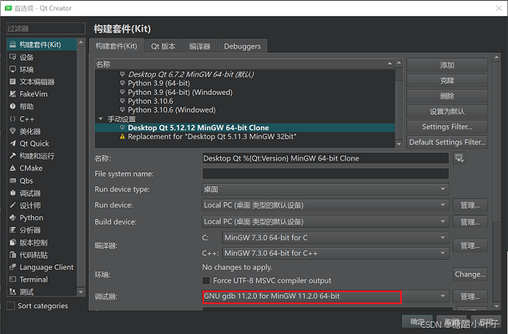

# Qt Launching Debugger启动失败

使用最新QtCreater和旧版的Qt Kit时可能出现无法启动调试器的情况。
解决方法：
将旧的Kit克隆一个副本，修改Kit的debugger到最新版即可
[https://forum.qt.io/topic/157956/launching-debugge-error](https://forum.qt.io/topic/157956/launching-debugge-error)

