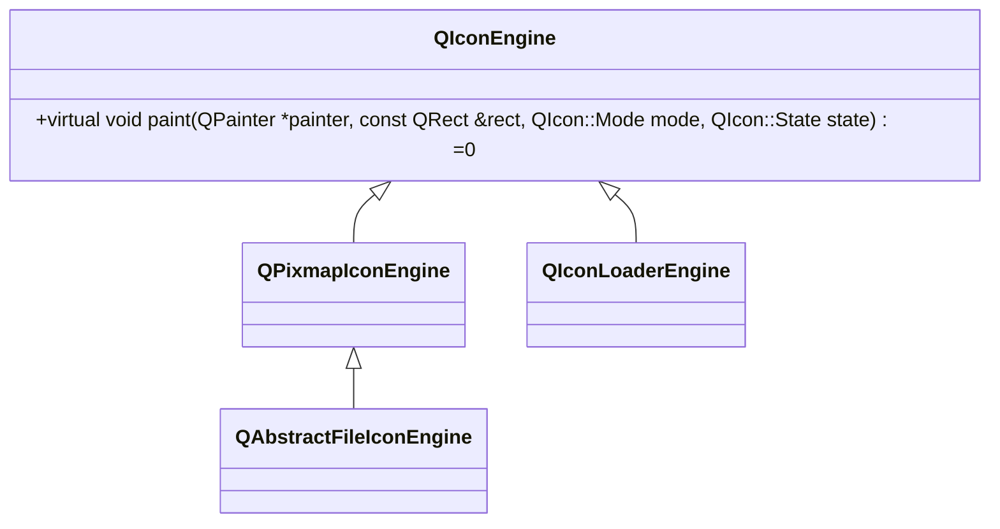
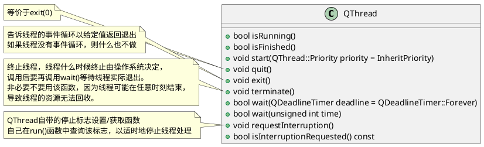
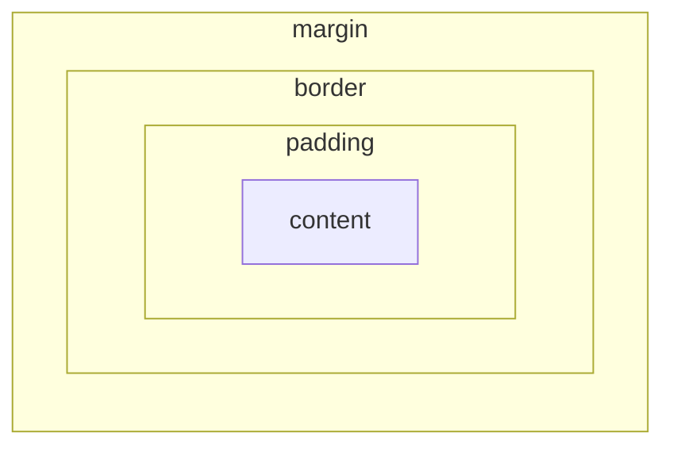

# Qt

## 用windeployqt工具对Qt程序进行打包

**Windeployqt**

```batch
cd $QTDIR\bin\
windeployqt.exe D:\a\xx.exe
:: 或者：
cd D:\a\
$QTDIR\bin\windeployqt.exe xx.exe
:: 所有依赖的Qt动态库都会复制到xx.exe所在目录下
```

xx.exe依赖的所有动态库都会拷贝到xx.exe所在的目录下

**注意**：依赖的mingw编译器的动态库不会复制，运行xx.exe更新错误提示复制缺的动态库就行了。通常下面三个动态库都是必须的。

> libgcc_s_seh-1.dll
> libstdc++-6.dll
> libwinpthread-1.dll

**特别注意**：缺libwinpthread-1.dll库不会报缺库错误，而是报“应用程序无法正常启动（0xc000007b）”错误。

可选项：

```
Options:
  -?, -h, --help            Displays this help.
  -v, --version             Displays version information.  --dir <directory>         Use directory instead of binary directory.
  --libdir <path>           Copy libraries to path.
  --plugindir <path>        Copy plugins to path.
  --debug                   Assume debug binaries.
  --release                 Assume release binaries.
  --pdb                     Deploy .pdb files (MSVC).
  --force                   Force updating files.
  --dry-run                 Simulation mode. Behave normally, but do not
                            copy/update any files.
  --no-patchqt              Do not patch the Qt5Core library.
  --no-plugins              Skip plugin deployment.
  --no-libraries            Skip library deployment.
  --qmldir <directory>      Scan for QML-imports starting from directory.
  --no-quick-import         Skip deployment of Qt Quick imports.
  --no-translations         Skip deployment of translations.
  --no-system-d3d-compiler  Skip deployment of the system D3D compiler.
  --compiler-runtime        Deploy compiler runtime (Desktop only).
  --no-compiler-runtime     Do not deploy compiler runtime (Desktop only).
  --webkit2                 Deployment of WebKit2 (web process).
  --no-webkit2              Skip deployment of WebKit2.
  --json                    Print to stdout in JSON format.
  --angle                   Force deployment of ANGLE.
  --no-angle                Disable deployment of ANGLE.
  --no-opengl-sw            Do not deploy the software rasterizer library.
  --list <option>           Print only the names of the files copied.
                            Available options:
                             source:   absolute path of the source files
                             target:   absolute path of the target files
                             relative: paths of the target files, relative
                                       to the target directory
                             mapping:  outputs the source and the relative
                                       target, suitable for use within an
                                       Appx mapping file
  --verbose <level>         Verbose level (0-2).
```

## 翻译（国际化）

1. 生成ts文件
   
   **QtCreator**
   
   * 在pro中加上TRANSLATIONS设置，如TRANSLATIONS += trans_zh_CN.ts，可以设置多个，每个对应生成的ts文件名
   
   * 并在Qt Creator中点击菜单栏-工具-外部-Qt语言家-更新翻译，默认在pro目录生成对应的ts文件
   
   **VS**
   
   * 扩展-Qt VS Tools-Create New Translation File
   
   * 右键新生成的ts文件，选择lupdate

2. 翻译ts文件
   
   使用Qt目录下的Linguist软件或文本编辑器翻译ts文件

3. 生成qm文件
   
   点击Qt Linguist文件-保存，再点文件-发布，
   
   或者保存后点QtCreator菜单栏-工具-外部-Qt语言家-发布翻译，
   
   或者VS右键保存的ts文件，选择lrelease

4. 使用翻译文件
   
   ```cpp
   QApplication app(argc, argv);
   QTranslator translator;
   // 直接加载指定的翻译文件
   translator.load("trans_zh_CN.qm");
   // 按系统设置自动加载不同的翻译文件，第二个参数是qm文件的相对目录
   translator.load("trans_" + QLocale::system().name(), "translations");
   app.installTranslator(&translator);
   ```

## 单元测试

1. 基本设置

pro工程文件加QT += testlib

```cpp
// 1. 包含头文件并且测试用例类必须继承QObject，测试函数必须声明为private slots
#include <QtTest/QtTest>

class TestQString : public QObject
{
    Q_OBJECT
private slots:
    void toUpper()
    {
        QString str = "Hello";
        QVERIFY(str.toUpper() == "HELLO");
    }
};

// 2. 声明运行单元测试所需的main函数
QTEST_MAIN(TestQString)
// 3. 如果测试用例类的声明和定义在同一个cpp里还需要包含对应的moc文件
#include "testqstring.moc"
```

2. 数据驱动的单元测试

```cpp
class TestQString: public QObject
{
    Q_OBJECT

private slots:
    void toUpper_data();    // toUpper测试的数据准备，必须以_data结尾
    void toUpper();
};
// 整个数据就是一个表格
void TestQString::toUpper_data()
{
    QTest::addColumn<QString>("string");
    QTest::addColumn<QString>("result");

    QTest::newRow("all lower") << "hello" << "HELLO";
    QTest::newRow("mixed")     << "Hello" << "HELLO";
    QTest::newRow("all upper") << "HELLO" << "HELLO";
}
// 测试会循环3次
void TestQString::toUpper()
{
    QFETCH(QString, string);
    QFETCH(QString, result);

    QCOMPARE(string.toUpper(), result);
}
```

## 属性系统 Q_PROPERTY

```cpp
Q_PROPERTY(bool focus READ hasFocus)
Q_PROPERTY(bool enabled READ isEnabled WRITE setEnabled)
Q_PROPERTY(QCursor cursor READ cursor WRITE setCursor RESET unsetCursor)
```

**动态属性**

```cpp
bool setProperty(QString name, QVariant value)
QVariant property(QString name)
```

使用setProperty()设置属性时，如果name不存在，会新建一个属性，该属性就为**动态属性**，该属性只能通过property()读取。

**在qss中使用**

```css
*[required="true"] {
    background-color: lime;
}
```

**注意**

Q_PROPERTY只是声明cursor是一个属性，cursor、setCursor、unsetCursor等函数依然需要自己在类内进行声明和定义。

## QElapsedTimer 计算时间间隔ns

```cpp
elapsed()         // 毫秒
nsecsElapsed()    // 纳秒
```

elapsed 过去的，经过的

## processEvents 强制处理Qt事件

如果某处理需要长时间占用CPU时间片，就可以偶尔调用该函数将事件队列里未处理的时间派发出去，让事件接收对象处理，避免界面卡住。

void QCoreApplication::processEvents(QEventLoop::ProcessEventsFlags flags = QEventLoop::AllEvents)

## QScrollArea和AdjustSize()

- **QScrollArea**不会因为自动布局而改变大小，必须手动调用setFixedSize()、setFixedHeight()、setFixedWidth()改变其大小。
  
  其默认会内嵌一个QWidget，该widget大小大于QScrollArea的大小时就会显示滚动条。

- 当一个窗口内的某个控件隐藏时，其他同级（在同一个layout里）的控件会自动占有空出的空间，整个窗口的大小是不会变的。如果想要整个窗口改变大小适应控件显隐造成的大小改变，可以调用**adjustSize()** 函数。

- adjustSize()有时候不能立即生效，比如QScrollArea里面自带的widget调用时遇到需要重新打开窗口才能生效的情况，改为SetFixedSize()就可以了。

## blockSignals(bool)

阻塞当前类发出信号，这些信号会被丢弃，不会进入队列，自身子部件发出的信号不会被阻断。

当给控件设置数据时可以用，这样外部就不会收到通知，直到全部数据设置完成。

signalsBlocked()可以查询是否被阻塞

## pressed和clicked信号的区别

pressed对应mousePressEvent()，按下即发出

clicked对应mouseReleaseEvent()，按下释放后发出，并且释放时鼠标需要在控件内

## QFileSystemModel只显示文件夹

即使设置了filter为Dirs，在QTreeView中没有子文件夹的文件夹前面依然会显示展开箭头

只需要重写QFileSystemModel的hasChildren函数即可

```cpp
bool MyFileSystemModel::hasChildren(const QModelIndex& parent) const
{
    // return false if item cant have children
    if (parent.flags() & Qt::ItemNeverHasChildren)
    {
        return false;
    }
    // return if at least one child exists
    return QDirIterator(
        filePath(parent), 
        filter() 
        | QDir::NoDotAndDotDot, 
        QDirIterator::NoIteratorFlags)
        .hasNext();
}
```

## QAbstractProxyModel代理模型

## 数字转字符串去除尾数0

```cpp
QString::number(value, 'f', QLocale::FloatingPointShortest)
```

## QIcon



* QIcon::addFile时传入的大小，是用于绘制时匹配最合适的图片，大致流程如下：
  
  * widget要画一个rect大小的图标
  
  * widget::paint
  
  * QIconEngine::paint(rect)
    
    * QIconEngine::scaledPixmap(rect)
      
      * QIconEngine::bestMatch(rect) // 用目标大小去匹配最优的pixmap
      
      * 对找到的pixmap进行缩放
    
    * painter->drawPixmap(scaledPixmap)

* QIcon有paint函数，可以直接绘制
  
  virtual void paint(QPainter *painter, const QRect &rect, QIcon::Mode mode, QIcon::State state) = 0;
  
  该函数会对pixmap进行缩放（QIconEngine::scaledPixmap(size, mode, state)），缩放到rect的大小
  
  * 一般用Icon的类都会有setIconSize()函数，最终图标会缩放到该大小。如QTreeView等各种view。
  
  * 例外是QMenu。没有setIconSize()函数，图标大小最大是16x16。解决办法时重写QCommonStyle类
    
    ```cpp
    class MenuIconStyle : public QCommonStyle
    {
    public:
        virtual int pixelMetric(PixelMetric metric, const QStyleOption* option, const QWidget* widget) const
        {
            int s = QCommonStyle::pixelMetric(metric, option, widget);
            if (metric == QStyle::PM_SmallIconSize) {
                s = _size;
            }
        }
    private:
        int _size = 24;
    };
    //
    // 自定义QMenu的构造：
    MenuIconStyle menuStyle = new MenuIconStyle ();
    menu->setStyle(menuStyle);
    ```

## QThread



### QMutex QMutexLocker

```cpp
QMutex m;
QMutexLocker locker(m);
locker.unlock();
locker.relock();
```

## 事件循环QEventLoop

事件循环调用exec()后，实际上就是在原地开了一个死循环对Qt事件进行处理，而不执行后面的代码。

exec()的默认参数是AllEvents，即处理所有事件，这意味着用户依然可以操作ui，如果exec()执行在了ui的处理过程中（如ui初始化）， 这可能导致程序崩溃。例如，点击a会删除b，而在b的构造中调用了exec()，如果在b的exec()时，用户点击了a，将会导致删除b，而此时b还没有完成构造，最终崩溃。

遇到这种情况，就要使用exec(ExcludeUserInputEvents)不处理用户输入。

exec()的可选参数如下：

后三个可以用按位或操作进行复数指定

| 参数                     | 描述                                                                |
| ---------------------- | ----------------------------------------------------------------- |
| AllEvents              | 所有事件都会被处理，对DeferredDelete事件做了特殊处理，回到deleteLater()被调用的事件循环才会执行删除操作 |
| ExcludeUserInputEvents | 不处理用户输入事件，比如鼠标和键盘操作                                               |
| ExcludeSocketNotifiers | 不处理socket的处理通知                                                    |
| WaitForMoreEvents      | 在没有事件需要处理时等待                                                      |

QEventLoop不仅可以用来阻塞代码，还可以在耗时处理中手动刷新ui，避免卡顿

可以在耗时操作中插入以下语句，除了指定flag，还可以指定最大执行时间

```cpp
QApplication::processEvent(QEventLoop::ProcessEventsFlags flags = AllEvents)
QApplication::processEvents(QEventLoop::ProcessEventsFlags flags, int maxTime)
```

## 事件QEvent

### sendEvent和postEvent

* sendEvent会立即去处理该事件，是同步的，而postEvent是将一个事件加入到事件队列中，在到达主循环的事件处理阶段才会同一处理，是异步的。

* postEvent是会按事件的优先级进行排序的。

* postEvent的event必须在堆上构造，由事件处理时进行释放，原因就是它是异步的。而sendEvent可以用栈上的临时QEvent对象。

## resize和move

* 调用resize()时，会更新geometry，因此之后调用size()获取的是新的大小。然后send一个ResizeEvent。

* move()时也一样，都是更新geometry，再send一个MoveEvent。

## QTextDocument

在QTextDocument中使用html时，字体颜色只能html中用color属性指定，用QTextCuror的QTextCharFormat是无效的。

### QTextCursor

* setCharFormart()：设置文字格式，全部替换

* mergeCharFormat()：融合文字格式，新的QTextCharFormat的属性和原有的冲突时才替换，新的没有指定的属性用原有的

## 设置无边框窗口或独立窗口圆角

设置背景透明Qt::WA_TranslucentBackground时，必须要设置背景颜色和FramelessWindowHint，不然会无效

```cpp
view()->window()->setWindowFlags(Qt::Popup | Qt::FramelessWindowHint 
                                | Qt::NoDropShadowWindowHint);
view()->window()->setAttribute(Qt::WA_TranslucentBackground);
```

## WindowType

**enum Qt::WindowType
flags Qt::WindowFlags**

This enum type is used to specify various window-system properties for the widget. They are fairly unusual but necessary in a few cases. Some of these flags depend on whether the underlying window manager supports them.

The main types are

| Constant          | Value                | Description                                                                                                                                                                                                                                                                                                                                                                                                                                                                                                                                                                                                                                                                                                                                                                                                                                                                                                                                       |
| ----------------- | -------------------- | ------------------------------------------------------------------------------------------------------------------------------------------------------------------------------------------------------------------------------------------------------------------------------------------------------------------------------------------------------------------------------------------------------------------------------------------------------------------------------------------------------------------------------------------------------------------------------------------------------------------------------------------------------------------------------------------------------------------------------------------------------------------------------------------------------------------------------------------------------------------------------------------------------------------------------------------------- |
| Qt::Widget        | 0x00000000           | This is the default type for [QWidget](../qtwidgets/qwidget.html). Widgets of this type are child widgets if they have a parent, and independent windows if they have no parent. See also Qt::Window and Qt::SubWindow.                                                                                                                                                                                                                                                                                                                                                                                                                                                                                                                                                                                                                                                                                                                           |
| Qt::Window        | 0x00000001           | Indicates表明 that the widget is a window, usually with a window system frame and a title bar, irrespective不考虑 of whether the widget has a parent or not. Note that it is not possible to unset this flag if the widget does not have a parent.                                                                                                                                                                                                                                                                                                                                                                                                                                                                                                                                                                                                                                                                                                     |
| Qt::Dialog        | 0x00000002 \| Window | Indicates that the widget is a window that should be decorated as a dialog (i.e., typically no maximize or minimize buttons in the title bar). This is the default type for [QDialog](../qtwidgets/qdialog.html). If you want to use it as a modal dialog, it should be launched from another window, or have a parent and used with the [QWidget::windowModality](../qtwidgets/qwidget.html#windowModality-prop) property. If you make it modal, the dialog will prevent other top-level windows in the application from getting any input. We refer to a top-level window that has a parent as a secondary window.                                                                                                                                                                                                                                                                                                                              |
| Qt::Sheet         | 0x00000004 \| Window | Indicates that the window is a sheet on macOS. Since using a sheet implies window modality, the recommended way is to use [QWidget::setWindowModality](../qtwidgets/qwidget.html#windowModality-prop)(), or [QDialog::open](../qtwidgets/qdialog.html#open)(), instead.                                                                                                                                                                                                                                                                                                                                                                                                                                                                                                                                                                                                                                                                           |
| Qt::Drawer        | Sheet \| Dialog      | Indicates that the widget is a drawer on macOS.                                                                                                                                                                                                                                                                                                                                                                                                                                                                                                                                                                                                                                                                                                                                                                                                                                                                                                   |
| Qt::Popup         | 0x00000008 \| Window | Indicates that the widget is a pop-up top-level window, i.e. that it is modal, but has a window system frame appropriate for pop-up menus.                                                                                                                                                                                                                                                                                                                                                                                                                                                                                                                                                                                                                                                                                                                                                                                                        |
| Qt::Tool          | Popup \| Dialog      | Indicates that the widget is a tool window. A tool window is often a small window with a smaller than usual title bar and decoration, typically used for collections of tool buttons. If there is a parent, the tool window will always be kept on top of it. If there isn't a parent, you may consider using Qt::WindowStaysOnTopHint as well. If the window system supports it, a tool window can be decorated with a somewhat lighter frame. It can also be combined with Qt::FramelessWindowHint. On macOS, tool windows correspond to the [NSPanel](https://developer.apple.com/documentation/appkit/nspanel) class of windows. This means that the window lives on a level above normal windows making it impossible to put a normal window on top of it. By default, tool windows will disappear when the application is inactive. This can be controlled by the [Qt::WA_MacAlwaysShowToolWindow](qt.html#WidgetAttribute-enum) attribute. |
| Qt::ToolTip       | Popup \| Sheet       | Indicates that the widget is a tooltip. This is used internally to implement [tooltips](../qtwidgets/qwidget.html#toolTip-prop).                                                                                                                                                                                                                                                                                                                                                                                                                                                                                                                                                                                                                                                                                                                                                                                                                  |
| Qt::SplashScreen  | ToolTip \| Dialog    | Indicates that the window is a splash screen. This is the default type for [QSplashScreen](../qtwidgets/qsplashscreen.html).                                                                                                                                                                                                                                                                                                                                                                                                                                                                                                                                                                                                                                                                                                                                                                                                                      |
| Qt::Desktop       | 0x00000010 \| Window | Indicates that this widget is the desktop. This is the type for QDesktopWidget.                                                                                                                                                                                                                                                                                                                                                                                                                                                                                                                                                                                                                                                                                                                                                                                                                                                                   |
| Qt::SubWindow     | 0x00000012           | Indicates that this widget is a sub-window, such as a [QMdiSubWindow](../qtwidgets/qmdisubwindow.html) widget.                                                                                                                                                                                                                                                                                                                                                                                                                                                                                                                                                                                                                                                                                                                                                                                                                                    |
| Qt::ForeignWindow | 0x00000020 \| Window | Indicates that this window object is a handle representing a native platform window created by another process or by manually using native code.                                                                                                                                                                                                                                                                                                                                                                                                                                                                                                                                                                                                                                                                                                                                                                                                  |
| Qt::CoverWindow   | 0x00000040 \| Window | Indicates that the window represents a cover window, which is shown when the application is minimized on some platforms.                                                                                                                                                                                                                                                                                                                                                                                                                                                                                                                                                                                                                                                                                                                                                                                                                          |

There are also a number of flags which you can use to customize the appearance of top-level windows. These have no effect on other windows:

| Constant                         | Value      | Description                                                                                                |
| -------------------------------- | ---------- | ---------------------------------------------------------------------------------------------------------- |
| Qt::MSWindowsFixedSizeDialogHint | 0x00000100 | Gives the window a thin dialog border on Windows. This style is traditionally used for fixed-size dialogs. |

Note: The use of this flag is not recommended in multi-monitor environments. This is because the system will enforce that the window maintains its native size when moving it across screens. This is particularly undesirable when using monitors with different resolutions.

| Constant                       | Value                   | Description                                                                                                                                                                                                                                                                                                                  |
| ------------------------------ | ----------------------- | ---------------------------------------------------------------------------------------------------------------------------------------------------------------------------------------------------------------------------------------------------------------------------------------------------------------------------- |
| Qt::MSWindowsOwnDC             | 0x00000200              | Gives the window its own display context on Windows.                                                                                                                                                                                                                                                                         |
| Qt::BypassWindowManagerHint    | 0x00000400              | This flag can be used to indicate to the platform plugin that "all" window manager protocols should be disabled. This flag will behave different depending on what operating system the application is running on and what window manager is running. The flag can be used to get a native window with no configuration set. |
| Qt::X11BypassWindowManagerHint | BypassWindowManagerHint | Bypass the window manager completely. This results in a borderless window that is not managed at all (i.e., no keyboard input unless you call [QWidget::activateWindow](../qtwidgets/qwidget.html#activateWindow)() manually).                                                                                               |
| Qt::FramelessWindowHint        | 0x00000800              | Produces a borderless window. The user cannot move or resize a borderless window via the window system. On X11, the result of the flag is dependent on the window manager and its ability to understand Motif and/or NETWM hints. Most existing modern window managers can handle this.                                      |
| Qt::NoDropShadowWindowHint     | 0x40000000              | Disables window drop shadow on supporting platforms.                                                                                                                                                                                                                                                                         |

The CustomizeWindowHint flag is used to enable customization of the window controls. This flag must be set to allow the WindowTitleHint, WindowSystemMenuHint, WindowMinimizeButtonHint, WindowMaximizeButtonHint and WindowCloseButtonHint flags to be changed.

| Constant                        | Value                                                | Description                                                                                                                                                                                                                                                                                                                                                      |
| ------------------------------- | ---------------------------------------------------- | ---------------------------------------------------------------------------------------------------------------------------------------------------------------------------------------------------------------------------------------------------------------------------------------------------------------------------------------------------------------- |
| Qt::CustomizeWindowHint         | 0x02000000                                           | Turns off the default window title hints.                                                                                                                                                                                                                                                                                                                        |
| Qt::WindowTitleHint             | 0x00001000                                           | Gives the window a title bar.                                                                                                                                                                                                                                                                                                                                    |
| Qt::WindowSystemMenuHint        | 0x00002000                                           | Adds a window system menu, and possibly a close button (for example on Mac). If you need to hide or show a close button, it is more portable to use WindowCloseButtonHint.                                                                                                                                                                                       |
| Qt::WindowMinimizeButtonHint    | 0x00004000                                           | Adds a minimize button. On some platforms this implies Qt::WindowSystemMenuHint for it to work.                                                                                                                                                                                                                                                                  |
| Qt::WindowMaximizeButtonHint    | 0x00008000                                           | Adds a maximize button. On some platforms this implies Qt::WindowSystemMenuHint for it to work.                                                                                                                                                                                                                                                                  |
| Qt::WindowMinMaxButtonsHint     | WindowMinimizeButtonHint \| WindowMaximizeButtonHint | Adds a minimize and a maximize button. On some platforms this implies Qt::WindowSystemMenuHint for it to work.                                                                                                                                                                                                                                                   |
| Qt::WindowCloseButtonHint       | 0x08000000                                           | Adds a close button. On some platforms this implies Qt::WindowSystemMenuHint for it to work.                                                                                                                                                                                                                                                                     |
| Qt::WindowContextHelpButtonHint | 0x00010000                                           | Adds a context help button to dialogs. On some platforms this implies Qt::WindowSystemMenuHint for it to work.                                                                                                                                                                                                                                                   |
| Qt::MacWindowToolBarButtonHint  | 0x10000000                                           | On macOS adds a tool bar button (i.e., the oblong button that is on the top right of windows that have toolbars).                                                                                                                                                                                                                                                |
| Qt::WindowFullscreenButtonHint  | 0x80000000                                           | On macOS adds a fullscreen button.                                                                                                                                                                                                                                                                                                                               |
| Qt::BypassGraphicsProxyWidget   | 0x20000000                                           | Prevents the window and its children from automatically embedding themselves into a [QGraphicsProxyWidget](../qtwidgets/qgraphicsproxywidget.html) if the parent widget is already embedded. You can set this flag if you want your widget to always be a toplevel widget on the desktop, regardless of whether the parent widget is embedded in a scene or not. |
| Qt::WindowShadeButtonHint       | 0x00020000                                           | Adds a shade button in place of the minimize button if the underlying window manager supports it.                                                                                                                                                                                                                                                                |
| Qt::WindowStaysOnTopHint        | 0x00040000                                           | Informs the window system that the window should stay on top of all other windows. Note that on some window managers on X11 you also have to pass Qt::X11BypassWindowManagerHint for this flag to work correctly.                                                                                                                                                |
| Qt::WindowStaysOnBottomHint     | 0x04000000                                           | Informs the window system that the window should stay on bottom of all other windows.                                                                                                                                                                                                                                                                            |

Note: On X11, this hint will work only in window managers that support _NET_WM_STATE_BELOW atom. If a window always on the bottom has a parent, the parent will also be left on the bottom. This window hint is currently not implemented for macOS.

Note: On Windows, this will work only for frameless or full-screen windows.

| Constant                                | Value      | Description                                                                                                                                                                                                                                                                                                                                                                                                                                                                                                                                                                                                                                    |
| --------------------------------------- | ---------- | ---------------------------------------------------------------------------------------------------------------------------------------------------------------------------------------------------------------------------------------------------------------------------------------------------------------------------------------------------------------------------------------------------------------------------------------------------------------------------------------------------------------------------------------------------------------------------------------------------------------------------------------------- |
| Qt::WindowTransparentForInput           | 0x00080000 | Informs the window system that this window is used only for output (displaying something) and does not take input. Therefore input events should pass through as if it wasn't there.                                                                                                                                                                                                                                                                                                                                                                                                                                                           |
| Qt::WindowOverridesSystemGestures       | 0x00100000 | Informs the window system that this window implements its own set of gestures and that system level gestures, like for instance three-finger desktop switching, should be disabled.                                                                                                                                                                                                                                                                                                                                                                                                                                                            |
| Qt::WindowDoesNotAcceptFocus            | 0x00200000 | Informs the window system that this window should not receive the input focus.                                                                                                                                                                                                                                                                                                                                                                                                                                                                                                                                                                 |
| Qt::MaximizeUsingFullscreenGeometryHint | 0x00400000 | Informs the window system that when maximizing the window it should use as much of the available screen geometry as possible, including areas that may be covered by system UI such as status bars or application launchers. This may result in the window being placed under these system UIs, but does not guarantee it, depending on whether or not the platform supports it. When the flag is enabled the user is responsible for taking [QScreen::availableGeometry](../qtgui/qscreen.html#availableGeometry-prop)() into account, so that any UI elements in the application that require user interaction are not covered by system UI. |
| Qt::WindowType_Mask                     | 0x000000ff | A mask for extracting the window type part of the window flags.                                                                                                                                                                                                                                                                                                                                                                                                                                                                                                                                                                                |

The WindowFlags type is a typedef for [QFlags](qflags.html)<WindowType>. It stores an OR combination of WindowType values.

## QTreeView

* 获取兄弟节点
  
  ```cpp
  QModelIndex 
  QAbstractItemModel::sibling(int row, int column, 
                              const QModelIndex & index)
  QModelIndex 
  QModelIndex::sibling(int row, int column) const
  ```

* 获取不可见根节点
  
  ```cpp
  QStandardItem * QStandardItemModel::invisibleRootItem()
  ```

## Qt Style Sheets（qss）

Qt参考文档 （Qt Assistance）搜索以下关键词即可。

Qt Style Sheets：介绍

Qt Style Sheets Reference：详细参考文档

### 1. The Box Model



* background只会绘制在border以内，所以margin内可能会出现透明线或其他异常显示

**默认相邻控件的边框不会互相影响，而嵌套的QWidget控件边框会互相影响**

* QWidget的contensMargin属性包括margin、border和padding，当改变三者的宽度时，该属性值就会变化
  
  QLayout的contensMargin的属性只是layout的边距
  
  setContentsMargin()并不是设置Box Model的margin，而是设置margin、padding和border的总和，但是并不改变三者的值。Box Model的margin要在qss中用margin属性设置

* 外层是QWidget时
  
  layout的大小和margin矩形一样大，也就是layout和父窗口间是没有间距的
  
  使用layout时，内部的widget实际处于border矩形中
  
  并且绘制时，是先绘制外层，再绘制内层，如果margin都是0，内层的border就会覆盖掉外层的border

* 外层是QFrame时
  
  layout的大小和content矩形一样大，这时内外窗口间的边框将不会互相影响
  
  但是里面的圆角还是会盖住外面的直角

### 2. The Style Sheet Syntax 语法

```css
QPushButton { color: red } /*最后一个可以不加分号*/
QPushButton { color: red; backgroud-color: white }

/*多个*/
QPushButton, QLineEdit, QComboBox { color: red }
```

### 3. Selector Types 选择器

| selector   | example                     | explanation     |
| ---------- | --------------------------- | --------------- |
| Universal  | *                           | 全选              |
| Type       | QPushButton                 | 按类型，含子类         |
| Property   | QPushButton\[flat="false"\] | 按属性             |
| Class      | .QPushButton                | 按类型，但只包含自己，不含子类 |
| ID         | QPushButton#okButton        | 按名称             |
| ID         | #okButton                   | 按名称             |
| Descendant | QDialog QPushButton         | 孩子、孙子。。。对象      |
| Descendant | QDialog *                   | 所有类型的孩子、孙子。。。对象 |
| Child      | QDialog > QPushButton       | 直接孩子对象          |

### 4. Sub-Controls 子控制器

```css
QComboxBox::drop-down { image: url(dropdown.png) }
```

### 5. Pseudo-States 状态

```css
QPushButton:hover { color: white }
QPushButton:hover:!pressed { color: blue } /* 状态AND */
QCheckBox:hover, QCheckBox:checked { color: white } /* 状态OR */
```

### 6. Conflict Resolution 冲突解决

* 更具体的优先

* 同级时后出现的优先（覆盖）
  
  A selector's specificity is calculated as follows:
  
  - count the number of ID attributes in the selector (= a)
  - count the number of other attributes and pseudo-classes in the selector (= b)
  - count the number of element names in the selector (= c)
  - ignore pseudo-elements
  
  Concatenating the three numbers a-b-c (in a number system with a large base) gives the specificity.
  
  Some examples:
  
  | 优先级 | example          | specificity value                      |
  | --- | ---------------- | -------------------------------------- |
  | 最低级 | \*               | /* a=0 b=0 c=0 -> specificity = 0 */   |
  |     | LI               | /* a=0 b=0 c=1 -> specificity = 1 */   |
  |     | UL LI            | /* a=0 b=0 c=2 -> specificity = 2 */   |
  |     | UL OL+LI         | /* a=0 b=0 c=3 -> specificity = 3 */   |
  |     | H1 + \*\[REL=up] | /* a=0 b=1 c=1 -> specificity = 11 */  |
  |     | UL OL LI.red     | /* a=0 b=1 c=3 -> specificity = 13 */  |
  |     | LI.red.level     | /* a=0 b=2 c=1 -> specificity =c 21 */ |
  | 最高级 | #x34y            | /* a=1 b=0 c=0 -> specificity = 100 */ |

### 7. Cascading 层叠

* 子对象会继承父对象的qss，并按self、parent、gradparent……的顺序融合
  
  ```cpp
  // QLineEdit有边框
  comboBox->setStyleSheet("QComboBox { border: 1px; } \
                          QLineEdit { border: 1px;}");
  ```

* 子对象设置qss后，优先用子对象的qss，不管qss语法优先级是怎样的
  
  ```cpp
  // QLineEdit有边框
  comboBox->setStyleSheet("QComboBox { border: 1px; } \
                          QLineEdit { border: 1px; }");
  // QLineEdit重设后无边框
  comboBox->lineEdit()->setStyleSheet("QLineEdit { border: none; }");
  ```

### 8. Inheritance 继承

* css子部件会继承父对象的font和color，但qss不会，必须直接指定
  
  例如在QComboBox中指定了QComboBox的边框，不会影响里面QLineEdit的边框：
  
  ```cpp
  // QLineEdit依然没有边框
  comboBox->setStyleSheet("QComboBox { border: 1px; }");
  
  // QLineEdit有边框
  comboBox->setStyleSheet("QComboBox { border: 1px; } \
                          QLineEdit { border: 1px;}");
  ```

* setFont()和setPalette()会传播到子部件

* 设置子部件字体和颜色传播：QCoreApplication::setAttribute(Qt::AA_UseStyleSheetPropagationInWidgetStyles, true);

### 9. 详解

* QTabWidget
  
  :tab-bar
  
  :pane

* QTabBar
  
  ::tab
  
  ::tear
  
  ::scroller

### 10. qss中的长度单位

qss中如果不指定单位的话，早期版本大多数默认为px，最好自己指定。

* px: pixels

* pt: the size of one point (i.e., 1/72 of an inch)

* em: the size relative to the font size of the element (e.g., 2em means 2 times the size of the font)

* ex: the x-height of the font (i.e., the height of 'x')

Qt中font只支持pt和px，而其他的只支持px，em或ex。

## 文件系统操作和文件读写

### 特定格式文件的读写

#### xml

* **QDomDocument**

* **QXmlStreamReader、QXmlStreamWriter**流式读写

#### json

相比于xml，json文件编解码难度低，文件更小。

* **QJsonDocument**
  
  读写json文件
- **QJsonArray、QJsonObject、QJsonValue**
  
  分别封装json的数组、对象和值类，json有6种基本数据类型：bool、double、string、array、object、 null。

#### 图片

* **QImage、QPixmap**

* **QImageReader、QImageWriter**

### 目录和文件操作

* QCoreApplication

* QFile

* QFileInfo

* QDir

* QTemporaryDir

* QTemporaryFile

* QFileSystemWatcher

#### QCoreApplication

* QString applicationDirPath()

* QString applicationFilePath()

* QString applicationName() 无后缀

* QStringList libraryPath()

* void addLibraryPath(QString& path)

* QString organizationName() 组织名

* void setOrganizationName(QString& name)

#### QFile

#### QFileInfo

#### QTemporaryDir

#### QTemporaryFile

#### QFileSystemWatcher

当目录下发生新建、删除文件等操作时，会发射directoryChanged()信号

当所监视的文件发生修改、重命名等操作时，会发射fileChanged()信号

### 读写文本文件

#### 用QFile读写文本文件

read()

readChar()

readLine()

readAll()

write()

putChar()

flush() 将缓存写入文件

bool atEnd() 判断是否到达文件末尾

open()

close()

#### 用QSaveFile保存文件

会生成一个临时文件，commit时才写入修改目标文件。

commit()

cancelWriting()

#### 用QFile和QTextStream读写文本文件

QTextStream(QIODevice* device)

支持<<和>>操作

### 读写二进制文件 QDataStream
