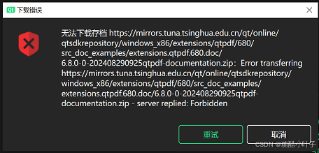
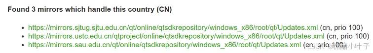

# Qt安装使用镜像源

众所周知，Qt安装用官方源下载会比较慢，甚至完全无法连接的情况，所以通常需要换国内的镜像进行下载。
官方镜像：[https://download.qt.io/](https://download.qt.io/)

## 1. Qt在线安装器下载

如果没有安装过Qt，进入[https://www.qt.io/download-dev](https://www.qt.io/download-dev)下载安装程序qt-online-installer-windows-x64-4.8.0.exe
如果已经安装了Qt，想更新Qt或安装其他版本的Qt，可以直接使用MaintenanceTool.exe进行更新、添加和移除组件（就在Qt的安装目录下）。

## 2. 换源

清华镜像：https://mirrors.tuna.tsinghua.edu.cn/qt

```bat
qt-online-installer-windows-x64-4.8.0.exe --mirror https://mirrors.tuna.tsinghua.edu.cn/qt
```

```bat
MaintenanceTool.exe --mirror https://mirrors.tuna.tsinghua.edu.cn/qt
```

## 3. 镜像拒绝连接（server replied: Forbidden）

用国内源下载时有时会遇到“无法下载存档。。。。。。 - server replied: Forbidden”的问题，可以换其他源进行下载。


可以在下面网页查看官方推荐的镜像：
[https://download.qt.io/online/qtsdkrepository/windows_x86/root/qt/Updates.xml.mirrorlist](https://download.qt.io/online/qtsdkrepository/windows_x86/root/qt/Updates.xml.mirrorlist)


国内镜像（CN）
https://mirrors.ustc.edu.cn/qtproject
https://mirrors.sau.edu.cn/qt
https://mirrors.sjtug.sjtu.edu.cn/qt