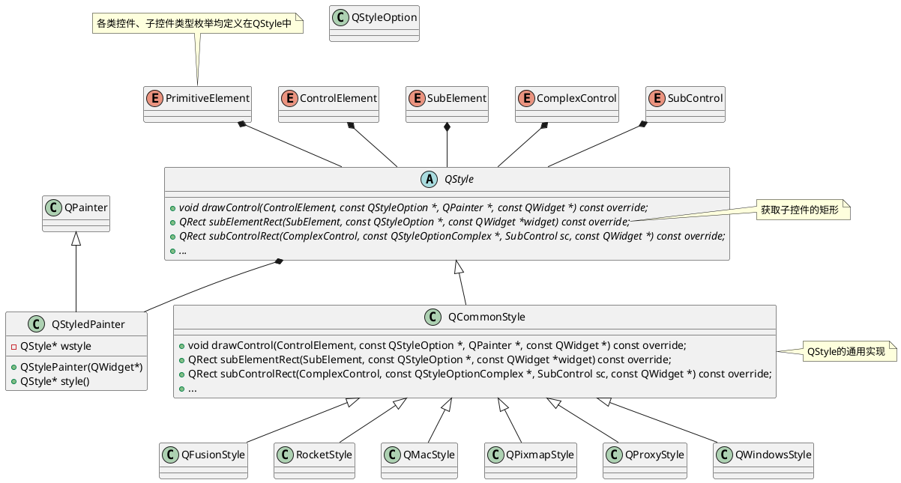

# QStyle

QStyle主要用于绘制控件

```plantuml
@startuml

note "各类控件、子控件类型枚举均定义在QStyle中" as n1
n1 -[hidden]-> PrimitiveElement
enum PrimitiveElement
enum ControlElement
enum SubElement
enum ComplexControl
enum SubControl

abstract class QStyle
{
    {abstract} +void drawControl(ControlElement, const QStyleOption *, QPainter *, const QWidget *) const override;
    {abstract} +QRect subElementRect(SubElement, const QStyleOption *, const QWidget *widget) const override;
    {abstract} +QRect subControlRect(ComplexControl, const QStyleOptionComplex *, SubControl sc, const QWidget *) const override;
    {abstract} {method} +...
}

note right of QStyle::subElementRect 
    获取子控件的矩形
end note

class QCommonStyle 
{
    +void drawControl(ControlElement, const QStyleOption *, QPainter *, const QWidget *) const override;
    +QRect subElementRect(SubElement, const QStyleOption *, const QWidget *widget) const override;
    +QRect subControlRect(ComplexControl, const QStyleOptionComplex *, SubControl sc, const QWidget *) const override;
    {method} +...
}

class QFusionStyle
class RocketStyle
class QMacStyle
class QPixmapStyle
class QProxyStyle
class QWindowsStyle

note right of QCommonStyle : QStyle的通用实现
PrimitiveElement *-- QStyle
ControlElement *-- QStyle
SubElement *-- QStyle
ComplexControl *-- QStyle
SubControl *-- QStyle

QStyle <|-- QCommonStyle
QCommonStyle <|-- QFusionStyle
QCommonStyle <|-- RocketStyle
QCommonStyle <|-- QMacStyle
QCommonStyle <|-- QPixmapStyle
QCommonStyle <|-- QProxyStyle
QCommonStyle <|-- QWindowsStyle

class QPainter

class QStyledPainter
{
    +QStylePainter(QWidget*)
    +QStyle* style()
    -QStyle* wstyle
}

QPainter <|-- QStyledPainter

QStyle *-- QStyledPainter


class QStyleOption

@enduml
```
