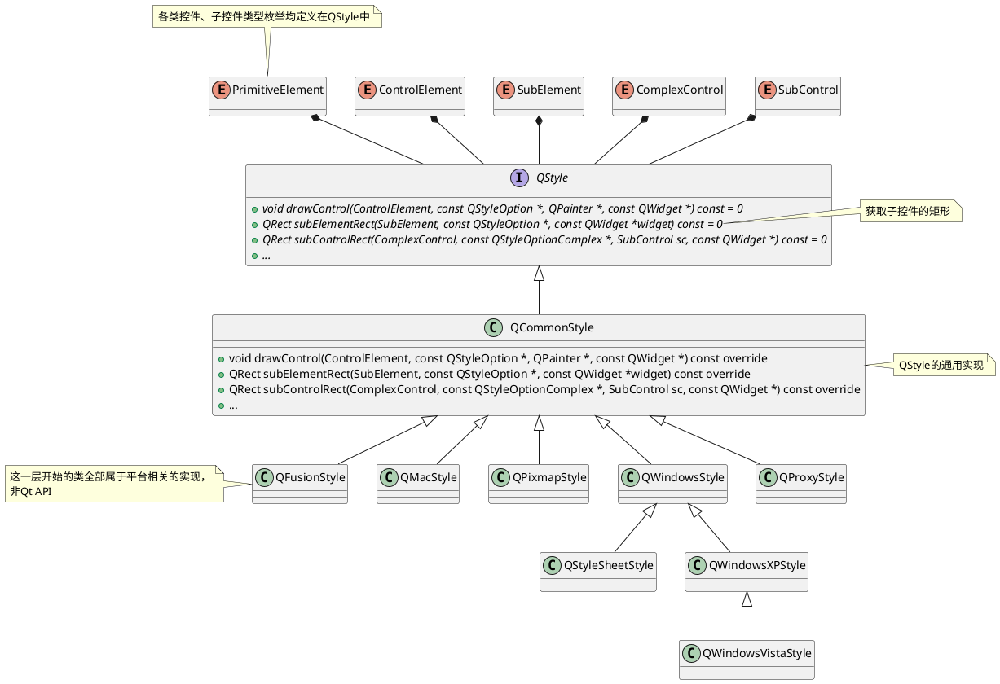

# QStyle

QStyle主要用于绘制控件

```plantuml
@startuml

note "各类控件、子控件类型枚举均定义在QStyle中" as n1
n1 -[hidden]-> PrimitiveElement
enum PrimitiveElement
enum ControlElement
enum SubElement
enum ComplexControl
enum SubControl

interface QStyle
{
    {abstract} +void drawControl(ControlElement, const QStyleOption *, QPainter *, const QWidget *) const = 0
    {abstract} +QRect subElementRect(SubElement, const QStyleOption *, const QWidget *widget) const = 0
    {abstract} +QRect subControlRect(ComplexControl, const QStyleOptionComplex *, SubControl sc, const QWidget *) const = 0
    {abstract} {method} +...
}

note right of QStyle::subElementRect 
    获取子控件的矩形
end note

class QCommonStyle 
{
    +void drawControl(ControlElement, const QStyleOption *, QPainter *, const QWidget *) const override
    +QRect subElementRect(SubElement, const QStyleOption *, const QWidget *widget) const override
    +QRect subControlRect(ComplexControl, const QStyleOptionComplex *, SubControl sc, const QWidget *) const override
    {method} +...
}

note right of QCommonStyle : QStyle的通用实现
PrimitiveElement *-- QStyle
ControlElement *-- QStyle
SubElement *-- QStyle
ComplexControl *-- QStyle
SubControl *-- QStyle

QStyle <|-down- QCommonStyle
QCommonStyle <|-- QFusionStyle
QCommonStyle <|-- QMacStyle
QCommonStyle <|-- QPixmapStyle
QCommonStyle <|-- QProxyStyle
QCommonStyle <|-- QWindowsStyle
QFusionStyle -[hidden] QMacStyle
QMacStyle -[hidden] QPixmapStyle
QPixmapStyle -[hidden] QWindowsStyle
QWindowsStyle -[hidden] QProxyStyle 

QWindowsStyle  <|-- QStyleSheetStyle
QWindowsStyle  <|-- QWindowsXPStyle
note left of QFusionStyle 
这一层开始的类全部属于平台相关的实现，
非Qt API
end note

class QWindowsVistaStyle
QWindowsXPStyle <|-- QWindowsVistaStyle

@enduml
```

# QStyleOption

```plantuml
@startuml

class QPainter

class QStyledPainter
{
    +QStylePainter(QWidget*)
    +QStyle* style()
    -QStyle* wstyle
}

QPainter <|-- QStyledPainter

class QStyleOption
{
    +void initFrom(const QWidget *w)
}

QStyleOption <|-- QStyleOptionFocusRect
QStyleOption <|-- QStyleOptionFrame 
QStyleOption <|-- QStyleOptionTabWidgetFrame
QStyleOption <|-- QStyleOptionTabBarBase
QStyleOption <|-- QStyleOptionHeader
QStyleOption <|-- QStyleOptionButton
QStyleOption <|-- QStyleOptionTab
QStyleOption <|-- QStyleOptionToolBar
QStyleOption <|-- QStyleOptionProgressBar
QStyleOption <|-- QStyleOptionMenuItem
QStyleOption <|-- QStyleOptionDockWidget
QStyleOption <|-- QStyleOptionViewItem
QStyleOption <|-- QStyleOptionToolBox
QStyleOption <|-- QStyleOptionRubberBand
QStyleOption <|-- QStyleOptionComplex
QStyleOption <|-- QStyleOptionGraphicsItem

QStyleOptionHeader <|-- QStyleOptionHeaderV2

QStyleOptionComplex <|-- QStyleOptionSlider
QStyleOptionComplex <|-- QStyleOptionSpinBox
QStyleOptionComplex <|-- QStyleOptionToolButton
QStyleOptionComplex <|-- QStyleOptionComboBox
QStyleOptionComplex <|-- QStyleOptionTitleBar
QStyleOptionComplex <|-- QStyleOptionGroupBox
QStyleOptionComplex <|-- QStyleOptionSizeGrip

class QFrame
{
    +{abstract} void initStyleOption(QStyleOptionFrame* option) const
    +void paintEvent(QPaintEvent* event) override
}

QStyleOption *-- QFrame
QPainter *-- QFrame


@enduml
```

```mermaid
classDiagram

class QPainter
class QStyledPainter {
    +QStylePainter(QWidget*)
    +QStyle* style()
    -QStyle* wstyle
}
QPainter <|-- QStyledPainter


class QStyleOption {
    +void initFrom(const QWidget *w)
}

QStyleOption <|-- QStyleOptionFocusRect
QStyleOption <|-- QStyleOptionFrame 
QStyleOption <|-- QStyleOptionTabWidgetFrame
QStyleOption <|-- QStyleOptionTabBarBase
QStyleOption <|-- QStyleOptionHeader
QStyleOption <|-- QStyleOptionButton
QStyleOption <|-- QStyleOptionTab
QStyleOption <|-- QStyleOptionToolBar
QStyleOption <|-- QStyleOptionProgressBar
QStyleOption <|-- QStyleOptionMenuItem
QStyleOption <|-- QStyleOptionDockWidget
QStyleOption <|-- QStyleOptionViewItem
QStyleOption <|-- QStyleOptionToolBox
QStyleOption <|-- QStyleOptionRubberBand
QStyleOption <|-- QStyleOptionComplex
QStyleOption <|-- QStyleOptionGraphicsItem

QStyleOptionHeader <|-- QStyleOptionHeaderV2

QStyleOptionComplex <|-- QStyleOptionSlider
QStyleOptionComplex <|-- QStyleOptionSpinBox
QStyleOptionComplex <|-- QStyleOptionToolButton
QStyleOptionComplex <|-- QStyleOptionComboBox
QStyleOptionComplex <|-- QStyleOptionTitleBar
QStyleOptionComplex <|-- QStyleOptionGroupBox
QStyleOptionComplex <|-- QStyleOptionSizeGrip

class QFrame {
    +void initStyleOption(QStyleOptionFrame* option) const
    +void paintEvent(QPaintEvent* event) override
}

QStyleOption *-- QFrame
QPainter *-- QFrame
```
