# 基础

## 代码注释

单引号'开头

# 组件图

## 组件

[component1]

component "component2"

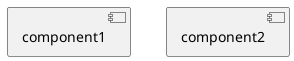

## 接口

() "interface1" as i1

interface "interface2" as i2

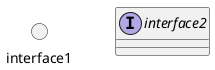

## 连线

### 基本符号

一个符号是水平方向，两个符号是垂直方向

..  .  --  -  =  ==  .>  ..>  ->  -->  =>  ==>

[a1]..[b1]

[a2].[b2]

[a3]--[b3]

[a4]-[b4]

[a5]==[b5]

[a6]=[b6]

[a1]..>[b1]

[a2].>[b2]

[a3]-->[b3]

[a4]->[b4]

[a5]==>[b5]

[a6]=>[b6]

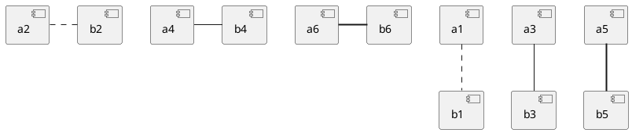

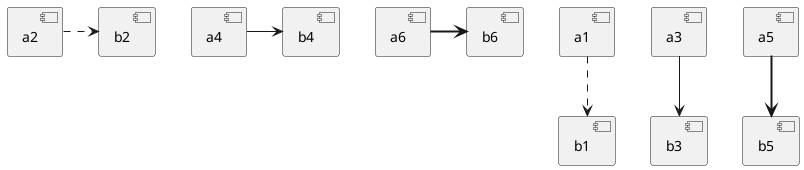

### 指定方向

-left->  -right->  -up->  -down->

-l-> -r-> -u-> -d->

### 连线风格

* 只能水平或垂直
  
  skinparam linetype ortho

* 直线，可以是斜的
  
  skinparam linetype polyline
1. 不指定：

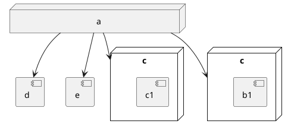

2. 水平或垂直：

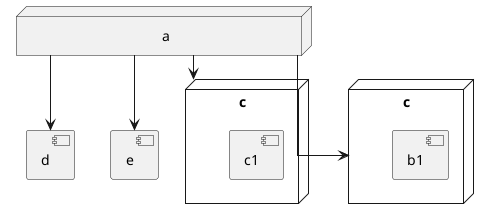

3. 直线

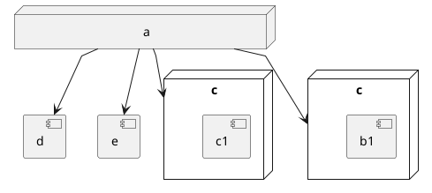

## 注释

[a]

note left of a: note222

[c]-->[d]: note333

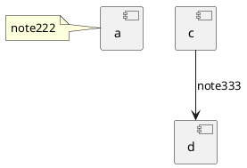

## 组合组件

组合组件里可以内嵌组合组件

### package

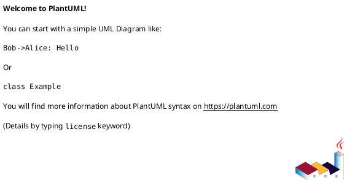

### node

### folder

### frame

### cloud

### database

## 辅助布局

* **together隐式分组**
  
  分组后如同**package**，布局会有和组合组件一样的问题，**组件不会自动排列到组合组件的下方**
  
  together {
   [a]-[b]
  }
  [c]
  [d]
  [e]

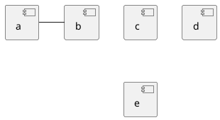

* **hidden隐藏链接**
  
  [a]-[hidden][b]
  
  [b]--[hidden][c]

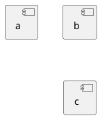

[[6. Layout — The Hitchhiker's Guide to PlantUML documentation (crashedmind.github.io)](https://crashedmind.github.io/PlantUMLHitchhikersGuide/layout/layout.html)]

* **节点间距和连线间距**

  skinparam nodesep 5

  skinparam ranksep 20

* 箭头加粗和长箭头
  
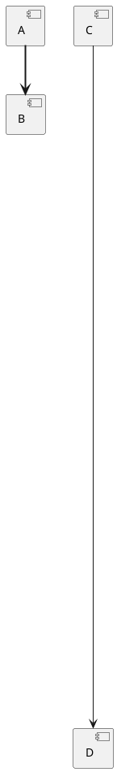

