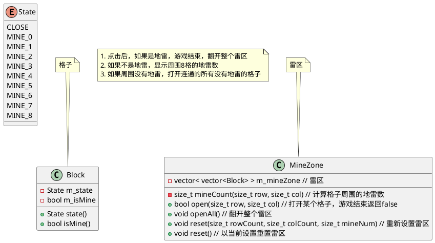

# 扫雷

```plantuml
@startuml

enum State{
    CLOSE   
    MINE_0
    MINE_1
    MINE_2
    MINE_3
    MINE_4
    MINE_5
    MINE_6
    MINE_7
    MINE_8
}
class Block {
    -State m_state
    -bool m_isMine
    +State state()
    +bool isMine()
}
note top of Block: 格子
note as noe_rule
1. 点击后，如果是地雷，游戏结束，翻开整个雷区
2. 如果不是地雷，显示周围8格的地雷数
3. 如果周围没有地雷，打开连通的所有没有地雷的格子
end note
class MineZone 
{
    -vector< vector<Block> > m_mineZone // 雷区
    -size_t mineCount(size_t row, size_t col) // 计算格子周围的地雷数
    +bool open(size_t row, size_t col) // 打开某个格子，游戏结束返回false
    +void openAll() // 翻开整个雷区
    +void reset(size_t rowCount, size_t colCount, size_t mineNum) // 重新设置雷区
    +void reset() // 以当前设置重置雷区
}
note top of MineZone: 雷区
```

# 游戏引擎

## 游戏循环

1. 计时

2. 按键事件

3. 游戏逻辑

4. 界面渲染
