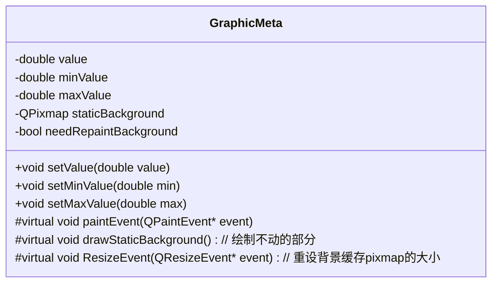

# 仪表盘Widget

将绘图分为静态的和动态的两个部分分别进行绘制，静态部分先绘制在QPixmap的缓存上，再在paintEvent中将QPixmap绘制到QWidget上。静态缓存只会在大小改变或静态部分相关参数（如仪表最小值和最大值）改变时进行重绘，可以大大加快绘制速度。特别是在静态背景很复杂的情况下，大量绘制操作只会执行一次，性能提升效果更加明显。

1. 绘制Widget背景

2. 如果静态部分或大小改变了，重绘静态部分的缓存

3. 绘制静态部分缓存到Widget

4. 绘制动态部分到Widget 

软件：

* Aseprite 像素画

* Spine 2d骨骼动画

* FL Studio 音乐

* ARPG 2D

武器

* 小剑、重剑

* 两种武器各有一套普通攻击，可以手动切换武器，普攻根据当前武器

* 武器会根据技能自动切换

* 释放技能后，释放什么武器的技能，当前就拿着什么武器

装备

* 衣服

* 

异常状态

* 感电：物理和电属性伤害增加

* 冰冻：冻结

* 出血：持续受伤，物理伤害增加

* 中毒：持续受伤

* 燃烧：持续受伤

技能

- 万剑归宗

- 穿刺，到后背
* 旋风斩

* 横扫

* 跳起，落地刺

世界观

* 

故事
