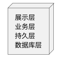
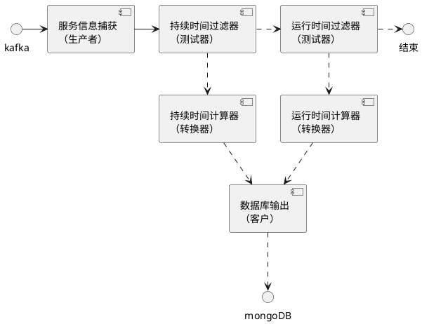
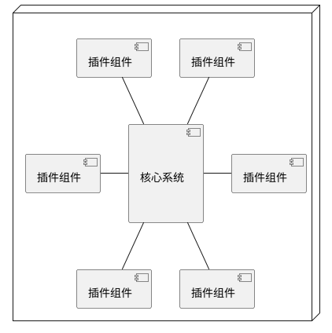
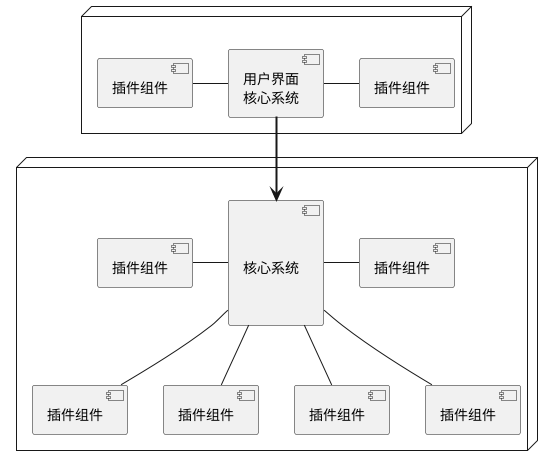
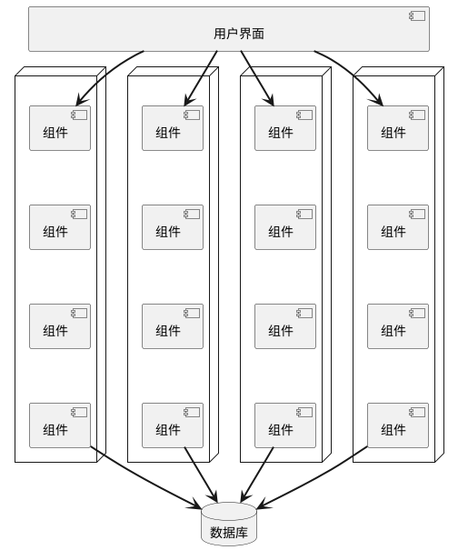
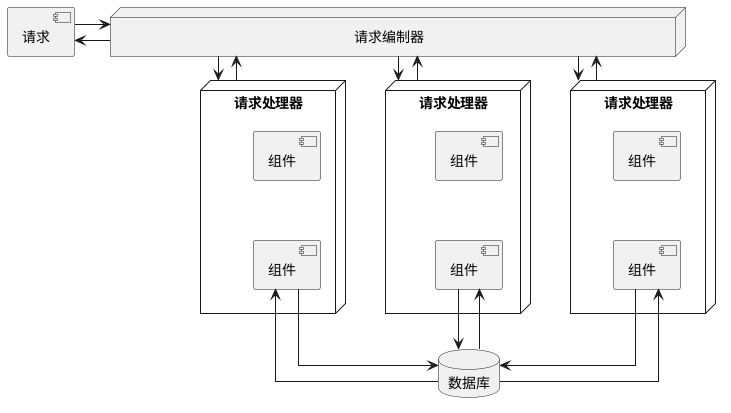
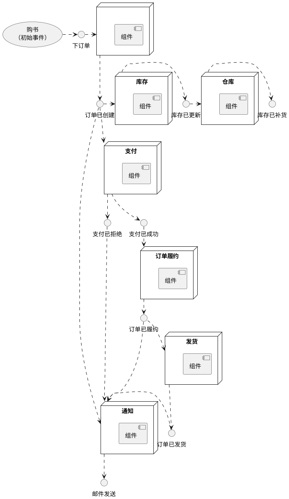

# 第一部分 基础

# 第1章 概述

## 1.2 架构师的角色期望

* 制定架构决策

* 持续分析架构

* 掌握最新趋势

* 确保决策被遵守

* 丰富的经历和经验

* 具备业务领域知识

* 具备人际交往能力

* 了解并驾驭政治

## 1.4 软件架构定律

* 软件架构中的一切都是在做权衡
  
  架构师若认为自己发现了不需要做权衡的东西，很可能他们只是还没有发现需要舍弃的东西而已

* 原因比方法更重要

# 第4章 现有的架构特征

## 4.1 部分已罗列出来的架构特征

### 4.1.1 运营性架构特征

| 术语      | 定义                                                      |
| ------- | ------------------------------------------------------- |
| 可用性     | 系统需要多长时间可用（启动时间）                                        |
| 连续性     | 灾难恢复能力                                                  |
| 性能      | 压力测试、峰值分析、所用功能的频率、所需容量、响应时间的分析等                         |
| 可恢复性    | 业务连续性要求（发生灾难时系统需要多长时间能够重新上线）                            |
| 可靠性/安全性 | 评估系统是否需要故障安全，或者是否是某种程度上会产生严重影响的关键任务。如果发生故障，是否会花费公司大量资金。 |
| 健壮性     | 如果互联网发生连接中断、断电或硬件故障，则能够在运行时处理错误和边界条件                    |
| 可伸缩性    | 随着用户或请求数量的增加，系统执行和操作的能力                                 |

### 4.1.2 结构性架构特征

| 术语          | 定义                                    |
| ----------- | ------------------------------------- |
| 可配置性        | 用户能（通过可用的界面）轻松更改所有用户配置                |
| 可扩展性        | 能够插入新的功能（非常重要）                        |
| 可安装性        | 易于安装                                  |
| 可利用性/可重复使用性 | 跨多个产品利用通用组件的能力                        |
| 本地化         | 支持多种语言、度量单位或货币                        |
| 可维护性        | 应用更改和增强系统非常容易                         |
| 可移植性        |                                       |
| 可支持性        | 应用需要支持什么级别的技术支持？系统中调试错误需要什么级别的日志和其他功能 |
| 可升级性        | 能够轻松快速地升级到新的版本                        |

### 4.1.3 跨领域架构特征

| 术语       | 定义                                     |
| -------- | -------------------------------------- |
| 可访问性     | 触达所用用户，包括残障人士                          |
| 可归档性     | 一段时间后是否需要归档或删除数据                       |
| 认证       | 验证用户身份                                 |
| 授权       | 限制用户权限，确保用户只能访问应用内指定的功能                |
| 法律       |                                        |
| 隐私性      | 能够向公司内部员工隐藏事务（加密的事务，即使DBA和网络架构师也看不到它们） |
| 安全性      | 数据库加密、通信加密、身份验证方式                      |
| 可支持性     | 应用需要支持什么级别的技术支持？系统中调试错误需要什么级别的日志和其他功能  |
| 易用性/可实现性 | 用户使用应用或解决方案实现其目标所需要的培训水平               |

#### 国际标准组织（ISO）发布的按功能组织的列表

| 术语    | 定义  |
| ----- | --- |
| 性能效率  |     |
| 兼容性   |     |
| 易用性   |     |
| 可靠性   |     |
| 安全性   |     |
| 可维护性  |     |
| 可移植性  |     |
| 功能适应性 |     |

**功能适应性**包含以下三个子特征

| 术语    | 定义                     |
| ----- | ---------------------- |
| 功能完整性 |                        |
| 功能正确性 |                        |
| 功能适当性 | 功能在多大程度上促进了特定任务的和目标的完成 |

## 4.2 权衡和最差可用的架构

**永远不要为最好的架构而努力，而要为最差可用的架构而努力。**

这表面架构师应该努力设计可迭代的架构。

# 第二部分 架构风格

# 第9章 基础

## 9.1 基础模式

### 9.1.1 大泥球

### 9.1.3 客户端/服务器

* 桌面 + 数据库服务器

* 浏览器 + Web服务器

* 三层架构

## 9.2 单体架构与分布式架构

**单体架构**

* 分层架构

* 管道架构

* 微内核架构

**分布式架构**

* 基于服务的架构

* 事件驱动架构

* 基于空间的架构

* 面向服务的架构

* 微服务架构

### 分布式计算的所有8个谬误

### 9.2.1 谬误1：网络是可靠的

### 9.2.2 谬误2：零延迟

### 9.2.3 谬误3：带宽是无限的

### 9.2.4 谬误4：网络是安全的

### 9.2.5 谬误5：网络拓扑结构从不改变

包括整个网络中使用的所有路由器、集线器、交换机、防火墙、网络和设备。

### 9.2.6 谬误6：只有一个管理员

### 9.2.7 谬误7：传输成本为零

### 9.2.8 谬误8：网络是同构的

同构：由同一个网络硬件供应商的设备组网的。

### 9.2.9 其他分布式方面的考虑

* 分布式日志

* 分布式事务
  
  架构师和开发人员认为事务是在一个统一的架构世界中是理所当然的，因为事务非常简单且易于管理。从持久性框架执行的标准commits和rollbacks利用ACID（原子性、一致性、隔离性、持久性）事务来确保以正确的方式更新数据，从而保证高数据一致性和完整性。蛋仔分布式架构中却不是这样的。
  
  分布式架构依赖于所谓的最终一致性，以确保不同部署单元处理的数据在某个未指定的时间点全部同步到一致状态。只是分布式架构的一个折中：以牺牲数据一致性和数据完整性为代价实现高可伸缩性、高性能和高科可用性。

* 契约维护和版本控制

# 第10章 分层架构风格

## 10.1 拓扑结构

# 第11章 管线架构风格

## 11.1 拓扑结构

### 11.1.2 过滤器

管道架构中存在4种类型的过滤器：

* 生产者
  
  进程的起点，仅供输出，有时称为源

* 转换器
  
  选择性地对部分或全部数据执行转换

* 测试器
  
  测试一个或多个条件，然后根据测试选择性地生成输出

* 消费者
  
  管道流的终点，使用者有时会将最终结果存数据库或显示在用户界面上

## 11.2 示例

# 第12章 微内核架构

## 12.1 拓扑结构

### 12.1.1 核心系统

分离用户界面（多个部署单元，均为微内核）

# 第13章 基于服务的架构风格

## 13.1 拓扑结构

# 第14章 事件驱动的架构风格

分布式异步架构风格

# 第15章 基于空间的架构风格

# 第16章 编制驱动的面向服务的架构

# 第17章 微服务架构

* 每个服务都包括在应用程序中运行所需要的一切，包括类、其他子组件和数据库模式。

* 微服务试图避免耦合，因此构建折中架构风格的架构师更喜欢复制而非耦合。

* 性能通常是微服务架构的副作用，因为网络调用通常比方法调用花费的时间长得多。

* 微服务是一种分布式架构，建议不要跨服务边界使用事务，确定服务的粒度是分布式架构成功的关键。

* 微服务的驱动哲学是有界上下文。

* 数据隔离是微服务的另一个需求。

# 第18章 选择合适的架构风格

# 第三部分 技巧和软技能
